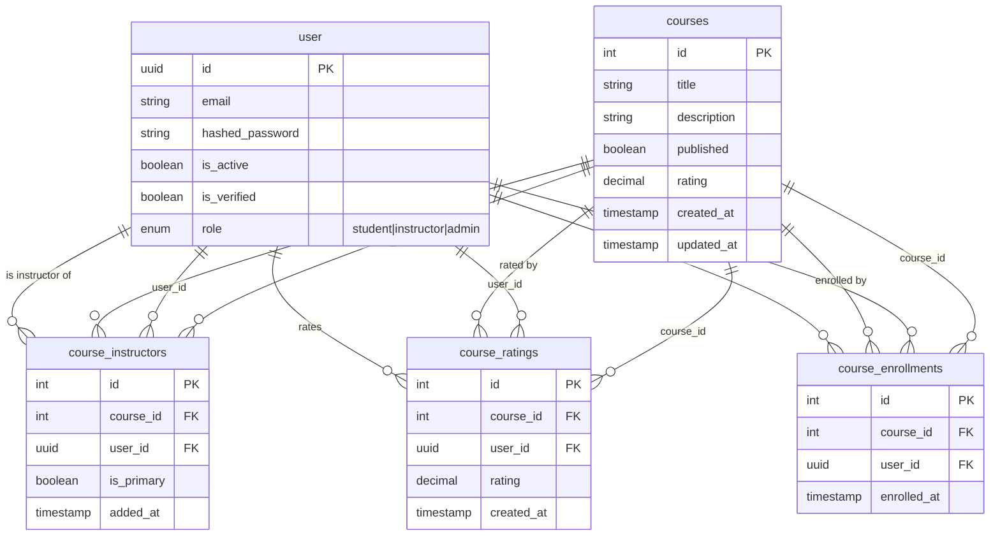

# Courses Model Design — Specification

Courses support one or many instructors per course. This document defines the specification only; no implementation code.

---

## Cardinality (Relationship Rules)

| Rule | Description |
|------|-------------|
| **One course → many instructors** | A single course can be created and managed by one or multiple instructors. |
| **One instructor → many courses** | A single instructor can create and manage multiple courses. |
| **One user → one rating per course** | A user may rate a course at most once. |
| **One user → many enrollments** | A user can enroll in any number of courses. |
| **One course → many enrollments** | A course can have many enrolled users. |
| **Unenrollment** | A user can unenroll from a previously enrolled course (removes the enrollment row). |

The instructor relationship is many-to-many via `course_instructors`. Ratings are stored in `course_ratings`; `courses.rating` is the aggregate (average) of those ratings. Enrollments are stored in `course_enrollments`.

---

## Table Specifications

### Table: `courses`

| Column | Type | Nullable | Default | Notes |
|--------|------|----------|---------|-------|
| id | integer | no | — | Primary key |
| title | string | no | — | |
| description | string | yes | — | |
| published | boolean | no | false | |
| rating | decimal(3,1) | yes | — | Aggregate average of course_ratings (1–5, one decimal); null when no ratings |
| created_at | timestamp (tz) | no | now() | |
| updated_at | timestamp (tz) | no | now() | Updated on row change |

### Table: `user` (existing)

| Column | Type | Nullable | Default | Notes |
|--------|------|----------|---------|-------|
| id | uuid | no | — | Primary key |
| email | string | no | — | |
| hashed_password | string | no | — | |
| is_active | boolean | no | — | |
| is_verified | boolean | no | — | |
| role | enum | no | student | student \| instructor \| admin |

Instructors are users with `role = instructor`.

### Table: `course_instructors` (junction)

| Column | Type | Nullable | Default | Notes |
|--------|------|----------|---------|-------|
| id | integer | no | — | Primary key (surrogate) |
| course_id | integer | no | — | FK → courses.id |
| user_id | uuid | no | — | FK → user.id |
| is_primary | boolean | no | false | Distinguishes primary vs co-instructor |
| added_at | timestamp (tz) | no | now() | |

**Constraints:**
- Foreign key `course_id` → `courses.id` with ON DELETE CASCADE
- Foreign key `user_id` → `user.id` with ON DELETE CASCADE
- Composite unique constraint on `(course_id, user_id)` — no duplicate instructor per course

### Table: `course_ratings`

| Column | Type | Nullable | Default | Notes |
|--------|------|----------|---------|-------|
| id | integer | no | — | Primary key |
| course_id | integer | no | — | FK → courses.id |
| user_id | uuid | no | — | FK → user.id |
| rating | decimal(3,1) | no | — | User's rating 1–5, one decimal (e.g. 2.5) |
| created_at | timestamp (tz) | no | now() | |

**Constraints:**
- Foreign key `course_id` → `courses.id` with ON DELETE CASCADE
- Foreign key `user_id` → `user.id` with ON DELETE CASCADE
- Composite unique constraint on `(course_id, user_id)` — **one rating per user per course**

### Table: `course_enrollments`

| Column | Type | Nullable | Default | Notes |
|--------|------|----------|---------|-------|
| id | integer | no | — | Primary key |
| course_id | integer | no | — | FK → courses.id |
| user_id | uuid | no | — | FK → user.id |
| enrolled_at | timestamp (tz) | no | now() | |

**Constraints:**
- Foreign key `course_id` → `courses.id` with ON DELETE CASCADE
- Foreign key `user_id` → `user.id` with ON DELETE CASCADE
- Composite unique constraint on `(course_id, user_id)` — one enrollment per user per course

**Behavior:** Enroll = insert row; unenroll = delete row.

---

## ORM / Persistence Requirements

| Requirement | Spec |
|-------------|------|
| **Relationship type** | Many-to-many via junction table |
| **Primary key (junction)** | Surrogate `id`; not a composite PK |
| **Uniqueness** | Composite unique on `(course_id, user_id)` |
| **Referential integrity** | CASCADE delete on both FKs |
| **Cascade (ORM)** | Deleting a course removes its junction rows |
| **Bidirectional navigation** | Course → instructors; User → instructed courses |
| **Ratings** | One row per (course, user); `courses.rating` = aggregate average |
| **Rating uniqueness** | Composite unique on `(course_id, user_id)` in `course_ratings` |
| **Enrollments** | One row per (course, user); users can enroll in any course |
| **Enrollment uniqueness** | Composite unique on `(course_id, user_id)` in `course_enrollments` |
| **Unenrollment** | Delete enrollment row; user may re-enroll later (new row) |

---

## API / Application Requirements

| Requirement | Spec |
|-------------|------|
| **Session** | Async database session via dependency injection |
| **Auth** | Course creation and management restricted to instructors (and admins) |
| **Schemas** | Request/response models for course CRUD; nested instructor data when needed |
| **Eager loading** | Instructors loadable with course to avoid N+1 |
| **Course details response** | When fetching course details, include: enrolled students count; instructors list |

---

## ERD (Mermaid)

---

## Optional Extensions (Future)

- `display_order` on `course_instructors` for instructor ordering
- `role` on junction (e.g. primary, co-instructor, teaching_assistant)
- `slug` on `courses` for SEO-friendly URLs
- `thumbnail_url`, `price`, etc. on `courses` for a richer product
